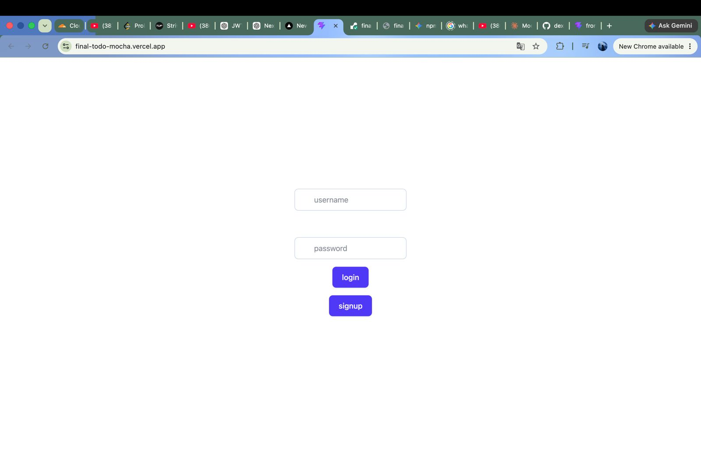
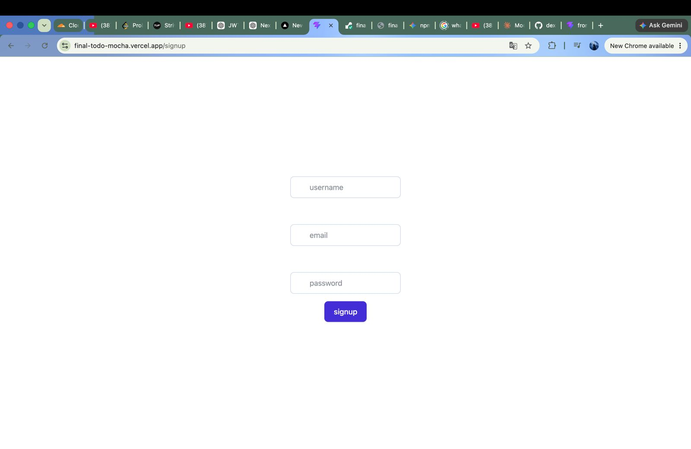
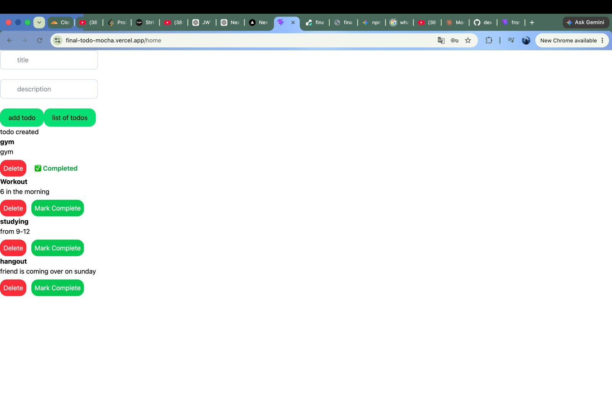

## 📸 Screenshots

### Login Page



### Signup Page



### Todo Dashboard



# MERN Todo App

A full-stack Todo application built with the MERN stack featuring JWT authentication, CRUD operations, and cloud deployment.

## Live Demo

Frontend: https://final-todo-mocha.vercel.app

Backend: https://final-todo-3b54.onrender.com

---

## Features

- User Signup & Login
- JWT Authentication
- Protected Routes
- Create Todo
- View Todos
- Mark Todo as Completed
- Delete Todo
- MongoDB Atlas Database
- Responsive UI

---

## Tech Stack

### Frontend
- React
- Vite
- Axios

### Backend
- Node.js
- Express.js
- MongoDB
- Mongoose
- JWT
- bcryptjs
- Zod

### Deployment
- Vercel
- Render
- MongoDB Atlas

---

## Folder Structure

```
final-todo/
│
├── frontend/
│
└── backend/
```

---

## Installation

### Clone the repository

```bash
git clone https://github.com/dexansh69/final-todo.git
```

### Backend

```bash
cd backend
npm install
```

Create a `.env` file:

```env
MONGO_URL=your_mongodb_connection_string
JWT_SECRET=your_secret
```

Start backend

```bash
npm start
```

---

### Frontend

```bash
cd frontend
npm install
```

Create `.env`

```env
VITE_BACKEND_URL=http://localhost:3000
```

Run frontend

```bash
npm run dev
```

---

## API Endpoints

### Auth

- POST /user/signup
- POST /user/signin

### Todos

- GET /todos/todo
- POST /todos/todo
- PUT /todos/todo/:id
- DELETE /todos/todo/:id

---

## Future Improvements

- Edit Todo title & description
- Due Dates
- Categories
- Search & Filter
- Dark Mode

---

## Author

GitHub:
https://github.com/dexansh69

mern
react
express
mongodb
nodejs
jwt
vite
axios
crud
fullstack